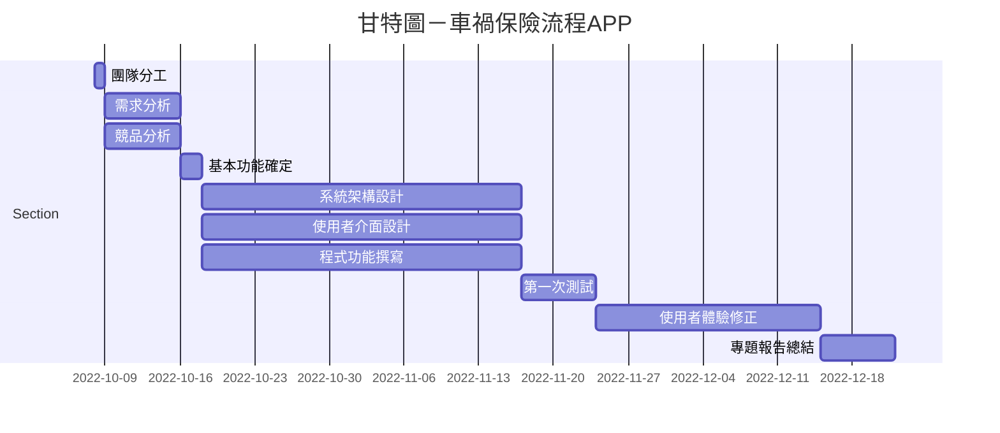

# group10

## 專題題目:車禍保險流程APP

|**班級**|**職務**|**學號**|**姓名**|**組員任務**|
|:---:|:-----:|:---------:|:-----:|:-------|
|3B|`組長`|C109118206|鄞佑珊|UI|
|3B|`組員`|C109118203|郭芸甄|UI|
|3B|`組員`|C109118205|羅志文|APP開發、後端|
|3B|`組員`|C109118213|黃己庭|APP開發、後端|
|3A|`組員`|C109118106|徐綜祥|伺服器、後端|

## 內容
透過APP的引導，讓車禍發生後讓駕駛人有概念處理車禍事故 
例如：
- 車禍車損拍照引導
- 保險專員分配與聯絡
- 事故處理流程引導
- 協助通報警方
- 車禍事故地點分享至警方或急救人員

## 甘特圖與PERT/CPM圖

  
[Source](https://hackmd.io/@RXiau6/H1RnaZyms)

