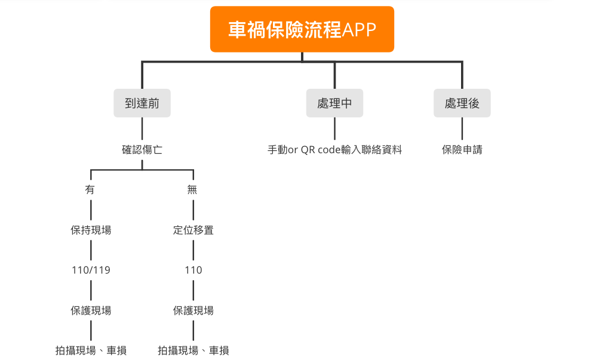

## 功能性需求與非功能性需求
### 功能性需求：

1.引導當下發生車禍的人去處理事故發生

2.協助人們向保險業者申請理賠

3.車禍車損拍照引導

### 非功能性需求：

1.可靠度-發生事故時，減少使用者當下遇緊急時刻的慌亂

2.使用性-將介面設計的簡潔易操作，方便使用者做使用

3.反應時間-流程順暢且可快速引導使用者所需

## 功能分解圖(functional decomposition diagram, FDD)

## 使用案例說明
|**使用案例名稱**|**車禍引導救援服務**     |
|:-------|:-----|
|**使用者**|發生車禍的使用者|
|**說明**|協助使用者處理事故現場|
|**完成動作**|1.引導使用者移至安全處 2.協助使用者撥打110/119專線 3.保護現場|
|**替代方案**|1.引導使用者移至安全處 2.協助使用者撥打110/119專線 3.保護現場|
|**先決條件**|事故發生|
|**後置條件**|配合警方處理|
|**假設**|尚無|

|**使用案例名稱**|**車損拍攝**|
|:-------|:-----|
|**使用者**|發生車禍的使用者|
|**說明**|協助使用者拍攝事故現場|
|**完成動作**|引導使用者拍攝現場及事故車輛|
|**替代方案**|引導使用者拍攝現場及事故車輛|
|**先決條件**|事故發生|
|**後置條件**|配合警方處理|
|**假設**|尚無|

|**使用案例名稱**|**分配保險專員**|
|:-------|:-----|
|**使用者**|發生車禍的使用者              |
|**說明**|協助使用者聯絡保險業者|
|**完成動作**|1.聯絡保險專員 2.提供現場圖、事故證明書等給保險專員 3.等待審核結果|
|**替代方案**|1.聯絡保險專員 2.提供現場圖、事故證明書等給保險專員 3.等待審核結果|
|**先決條件**|本身已有保險|
|**後置條件**|等待審核結果|
|**假設**|尚無|

## Figma
[車禍保險流程](https://www.figma.com/proto/eDV6RaTzxPaKdVCo2svNlN/%E8%BB%8A%E7%A6%8D%E4%BF%9D%E9%9A%AA%E6%B5%81%E7%A8%8B-APP?node-id=5%3A4&scaling=scale-down&page-id=0%3A1&starting-point-node-id=5%3A4)
